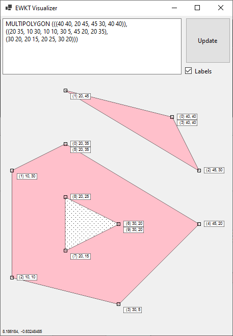
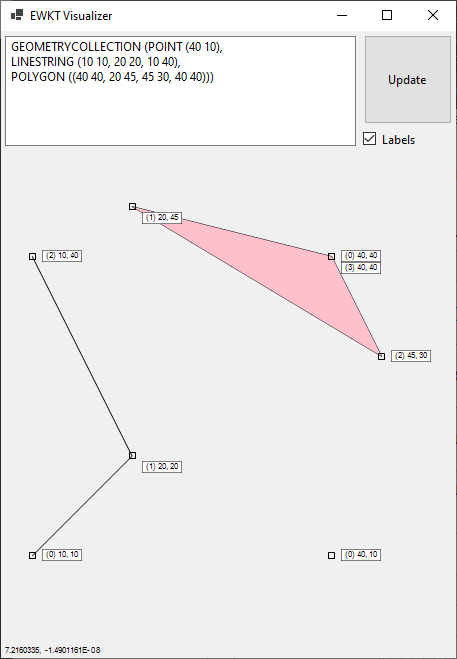

# EWKT [](https://github.com/0xRCE/EWKT/actions/workflows/dotnet.yml)

A library for Extended Well-Known Text (WKT/EWKT) parsing and serialization. The project contains an example winforms project for visualizing EWKT.

From wikipedia
> Well-known text (WKT) is a text markup language for representing vector geometry objects. A binary equivalent, known as well-known binary (WKB), is used to transfer and store the same information in a more compact form convenient for computer processing but that is not human-readable. The formats were originally defined by the Open Geospatial Consortium (OGC) and described in their Simple Feature Access.[1] The current standard definition is in the ISO/IEC 13249-3:2016 standard.[2]

###Supported types:
* Point(Z)
* LineString(Z)
* CircularString(Z)
* Polygon(Z)
* CurvedPolygon(Z)
* MultiPolygon(Z)
* CompoundCurve(Z)
* GeometryCollection

# Examples

## Visualizer




## Code

````C#
string ewkt = "POINT (10 20)";
IGeometry point = EWKTParser.Convert(ewkt);

EWKTSerializer.Serialize(point); // POINT Z (10 20 0)
````

````C#
IGeometry point = new PointZ(10.0d, 24.5d, 0.0d);

string ewkt = EWKTSerializer.Serialize(point); // POINT Z (10 24.5 0)

````